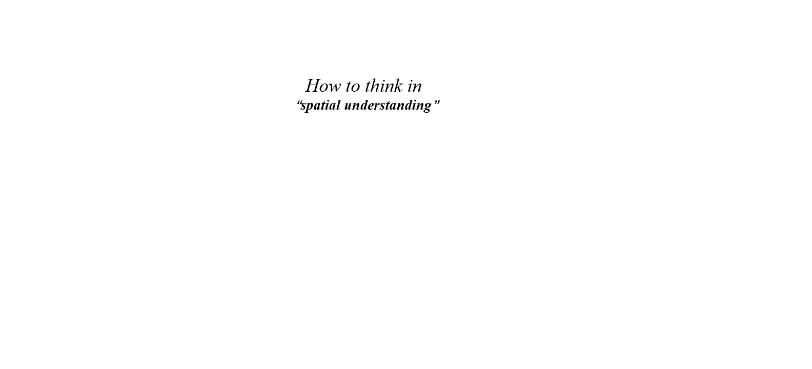
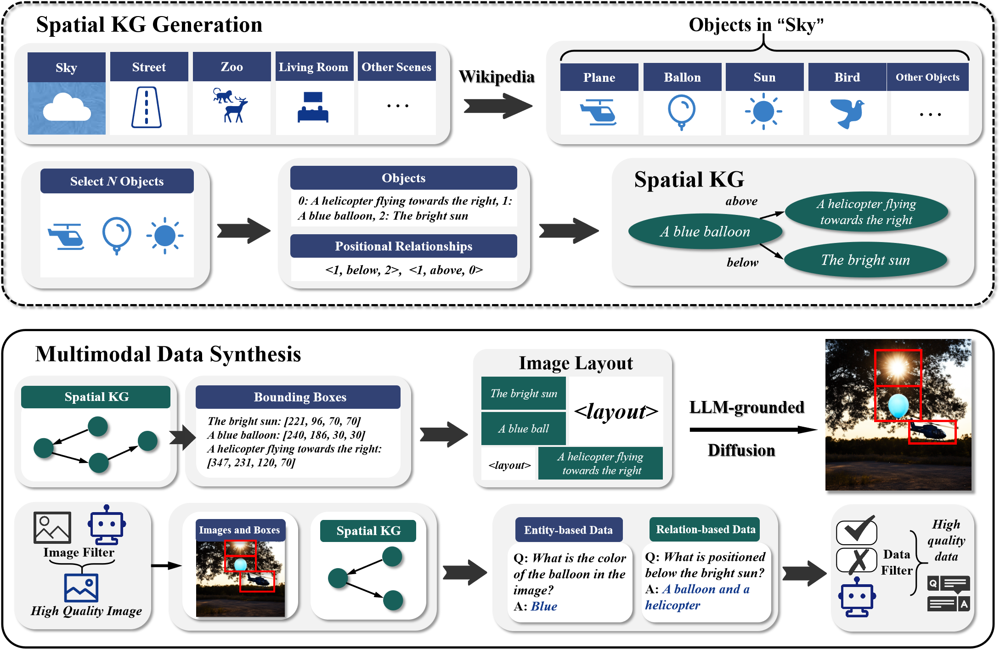

<div align="center">
<h1 align="center"> 👉 Knowledge2Data 👈 </h1>
<b>Spatial Knowledge Graph-Guided Multimodal Synthesis</b>

[](https://github.com/zjunlp/Knowledge2Data) 
[](https://opensource.org/licenses/MIT)

<div align="center">

</div>

<p align="center">
  <a href="https://github.com/zjunlp/Knowledge2Data">Project</a> •
  <a href=https://github.com/zjunlp/Knowledge2Data"">Paper</a> •
  <a href="https://github.com/zjunlp/Knowledge2Data">Web</a> •
  <a href="#overview">Overview</a> •
  <a href="#quickstart">Quickstart</a> •
  <a href="#citation">Citation</a>
</p>

</div>

## Table of Contents

- <a href="#news">What's New</a> •
- <a href="#overview">Overview</a> •
- <a href="#quickstart">Quickstart</a> •
- <a href="#citation">Citation</a>

## 🔔News
- **2025-02-28, We release the paper.**
---

## 🌟Overview
<div align="center">

</div>


## ⏩Quickstart
### Installation
```
git clone https://github.com/zjunlp/Knowledge2Data
cd Knowledge2Data
conda create -n skg python==3.9
conda activate skg
pip install -r requirements.txt
```

### Download the models
#### Download the following models from HuggingFace

| 🎯 Model Name                 | 🤗 HuggingFace                                                            |
|-------------------------------|---------------------------------------------------------------------------|
| Diffusers-generation-text-box | [gligen/diffusers-generation-text-box](https://huggingface.co/gligen/diffusers-generation-text-box) |
| Sam-vit-base                  | [stabilityai/stable-diffusion-xl-refiner-1.0](https://huggingface.co/stabilityai/stable-diffusion-xl-refiner-1.0)       |
| Stable-diffusion-xl-refiner   | [facebook/sam-vit-base](https://huggingface.co/facebook/sam-vit-base)      |

### Export the environment variables.
```shell
cd src
export OPENAI_API_KEY="YOUR_API_KEY"
export SKG_HF_MODELS="LOCAL_HUGGINGFACE_MODELS_DIR"
```
### Generate Spatial KG and multimodal synthetic data.
#### Execute script to generate Spatial KG.
```shell
sh run_skg.sh
```
You can also customize objects and their spatial relationships to form Spatial KG. Save the file format as a JSON file similar to "src/data/skg_demo.json".
#### Execute script to multimodal synthetic data.
```shell
sh run_data.sh
```
For custom data, only the input file parameters "--input_file" need to be modified.

You can find generated data in "src/data" and images in "src/img_generations" as default.
If you want to generate more data, you can modify the parameters including "--num_scenes" ([generate_scenes.py](src%2Fgenerate_scenes.py)) and "--repeats" ([generate_images.py](src%2Fgenerate_images.py)).

## 🌻Acknowledgement

This project is based on open-source projects including [LLM-groundedDiffusion](https://github.com/TonyLianLong/LLM-groundedDiffusion). Thanks for their great contributions!

### 🚩Citation

Please cite the following paper if you use this project in your work.

```bibtex

```

---
